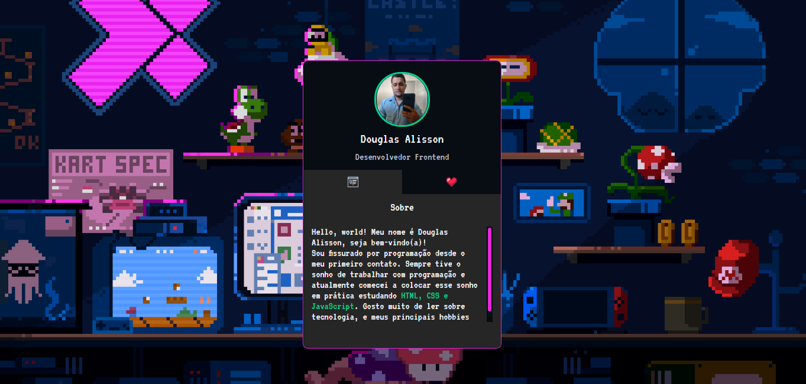

# [Mini Portfólio](https://devdouglasa.github.io/mini-portifolio/) | HTML, CSS e JavaScript.

## :page_facing_up: Sobre o Projeto
- Este projeto trata-se de um mini portfólio que foi desenvolvido como parte da MapaDev Week - evento feito pela [Dev em Dobro](https://github.com/devemdobro) em outubro de 2022.
- Criado em 16/10/2022
---
## :framed_picture: Imagens do Projeto

---
## :woman_technologist:  Autora

<table class="author">
  <tr>
    <td align="center">
      <a href="https://github.com/devdouglasa">
         
        
          <b>Douglas Alisson</b>
        
      </a>
    </td>
  </tr>
</table>   
   Linkedin:
   https://www.linkedin.com/in/douglas-alisson-445493219/
   
   E-mail: douglasalisson27@gmail.com
   
  ## 📝 Licença
  
   O projeto o possui a licença _MIT_, veja o arquivo [LICENSE](LICENSE) para mais informações.
